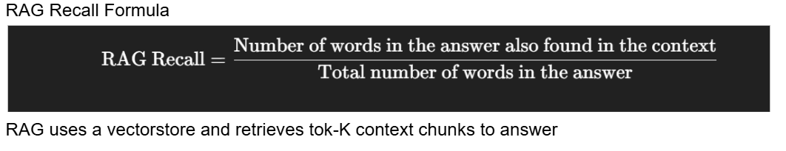

## Formula's to Measure Recall (number of relevant items correct) 




## Notebook setup:

```bash 
cd py-final

python3.11 -m venv krag-env

source krag-env/bin/activate

pip install -r requirements.txt

python -m ipykernel install --user --name=krag-env --display-name "Python (krag-env)"


jupyter notebook
```
visit url to run 

----------------------------------------------------------------------------------------------------------------------------
## Project Description: 

This project implements a hybrid retrieval-augmented generation (RAG) system enhanced with a domain-specific knowledge graph. 
The workflow includes training a custom relationship extraction model, extracting semantic relationships to build a knowledge graph, and integrating graph triples into an LLM pipeline for improved question answering.

Using the global news dataset to gather 100-200 news article documents for KRAG 

https://www.kaggle.com/datasets/everydaycodings/global-news-dataset

